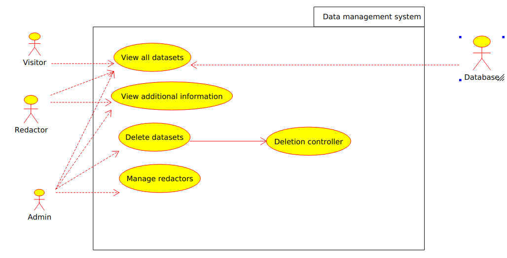

# CУД

__Система управління даними__ – це різновид програмного забезпечення для роботи з базами даних.  
 Зараз основний вигляд СУД – це клієнтсько-серверна частина СУБД, сама СУБД знаходиться на сервері і опрацьовує запити від клієнтської частини програми, яка знаїодиться на комп'ютерах користувачів. Програма клієнта відправляє запити на сервер і демонструє відповіді користувачу, коли сервер відправляє ці відповіді.  
 [sourse](http://usu.kz/wiki/sistema_upravleniya_dannimi.php)
 
## Проблеми які вирішує СУД:
-  **АКТУАЛЬНІСТЬ** - Прийняті управлінські рішення на підставі застарілих даних.
Неякісні сервіси через застарілі (не отриманих вчасно) даних
- **ДОСТОВІРНІСТЬ** - Невірні відомості
- **БЕЗПЕКА** - Не врегульовані питання володіння даними / Низька культура
поводження з даними / Непрозоре використання даних
- **ДОСТУПНІСТЬ** - Немає можливості отримати потрібні данні для бізнесу
- **ВИСОКЕ НАВАНТАЖЕННЯ НА БІЗНЕС / ГРОМАДЯНИНА** - великі обсяги звітності (з високою часткою дублювання) бізнесу в різні ОВВ / велика кількість документів від
громадянина для отримання послуг

## Управління даними
Управління даними (англ. Data management) - процес,
пов'язаний зі створенням, зміною та видаленням даних,
організацією їх зберігання і пошуку.

### Процеси управління даними
* Аналіз даних
* Архітектура даних
* Добування даних
* Захист даних
* Вибір, перетворення і завантаження даних
* Моделювання даних
* Забезпечення якості даних
* Робота з базами даних
* Управління метаданими
* Шифрування даних

------------
# Використання процесу  

## [Аналіз та проектування](http://dit.isuct.ru/Publish_RUP/core.base_rup/capabilitypatterns/resources/analysis_design_discipline_49725AC4_49725ac4_Activity.jpeg)  

* __Аналіз поведінки__  

    Елементи струтури:  

        1. Визначення елементыв проекту  
        2. Аналіз прецедентів  
        3. Аналіз оперіції  
        4. Проектування інтерфейсу  
        5. Створення прототипу інтерфейсу  
        6. Перевірка проекту  

## [Розгортання](http://dit.isuct.ru/Publish_RUP/core.base_rup/capabilitypatterns/resources/deployment_7AEEEFEA_7aeeefea_Activity.jpeg)  

* __Тестування бета-версії продукту__  

    Елементи структури:  

        1. Вибір бета-тестів  
        2. Підготовка  
        3. Перевірка результатів  
        4. Зворотній звязок  

## [Тестування](http://dit.isuct.ru/Publish_RUP/core.base_rup/capabilitypatterns/resources/test_7EF99F54_7ef99f54_Activity.jpeg)

* __Визначення цілі продукту__  

    Елементи структури:  

        1. Визначення мотиваційних чинників тестування  
        2. Узгодження мети  
        3. Визначення цілі тесту  
        4. Визначення потреб в оцінюванні відслідковування  
        5. Визначення ідеї тестування  
        6. Визначення підходу до тестування  

## [Вимоги](http://dit.isuct.ru/Publish_RUP/core.base_rup/capabilitypatterns/resources/requirements_4EE062EE_4ee062ee_Activity.jpeg)  

* __Аналіз неполадок__  

    Елементи структури:

        1. Створення загального словника
        2. Пошук суб'єктів і варіантів
        3. Розробка бачення
        4. Розробка плану управління вимогами

* __Визначення потреб зацікавлених осіб__  

    Елементи структури:

        1. Створення загального словника
        2. Визначення потреб зацікавлених осіб
        3. Розробка бачення
        4. Пошук Пошук суб'єктів і варіантів
        5. Розробка додаткових специфікацій
        6. Управління залежностями

* __Створення визначення системи__

    Елементи структури:

        1. Розробка бачення
        2. Створення загалгьного словника
        3. Пошук суб'єктів і варіантів
        4. Розробка додаткових специфікацій
        5. Керування залежностями

* __Управління областю системи__  

    Елементи структури:

        1. Розробка бачення
        2. Керування залежностями
        3. Встановлення приорітету варіантів

* __Уточнення визначення системи__

    Елементи структури:

        1. Створення детального опису варіантів
        2. Розробка додаткових специфікацій
        3.Створення докладного опису вимог до програмного забезпечення  

* __Керування змінами вимог__

    Елементи структури:

        1.Створення структур моделі процесів
        2. Управління залежностями
        3. Перевірка вимог  

[sousrce](http://dit.isuct.ru/Publish_RUP/core.base_rup/workproducts/rup_stakeholder_requests_A89D2BF9.html)  

------------  

## [PMD-система](https://ru.wikipedia.org/wiki/PDM-система)
  
__Система управління даними про виріб__ - організаійно-технічна система, яка дозволяє керувати всіма даними, які пов'язані з певним продуктом.  
__Базові функції та можливості PMD систем__:

* Управління та керування даних і документів  
* Управління робочими процесами
* Управління структурою продукта
* Автоматизація генерації вибірок та звітів  

__У PMD системі мають бути реалізовані такі технології__:

* Управління інженерними даними
* Управління документами
* Управління інформацією про виріб
* Управління технічними даними
* Управління технічною інформацією
* Управління зображенями та маніпуляція інформацією, яка описує виріб  

-------------

## Моделі що описують Системи Управління Данними
* [EDM Council Data Management Capability Assessment Model (DCAM)](https://dgpo.org/wp-content/uploads/2016/06/EDMC_DCAM_-_WORKING_DRAFT_VERSION_0.7.pdf)
* [CMMI Data Management Maturity Model (DMM)](https://cmmiinstitute.zendesk.com/hc/en-us/articles/218924137-What-is-a-DMM-assessment-and-how-to-get-more-information-about-it-)                                                                                                                                                 
* [CC CDQ Data Excellence Model (DXM)](https://www.cc-cdq.ch/data-excellence-model)
* [IDC Information Transformation Maturity Model](https://www.linkedin.com/pulse/managing-enterprise-content-idc-maturity-model-holly-muscolino)
* Gather Enterprise Information Management Maturity Model

# Опис DMM моделі
DMM оціннювання (Оцінка зрілості управління данними) базується на основі нарад між колегами
і швидко виявляє в організації її поточні можливості, рівні зрілості її проектів, і визначає                         
зони де потрібні додаткові ресурси.  
Результат оцінювання це детальний звіт що використовується для розробки нових стратегій і застосувань     
запланованих дій.    
**Переваги DMM моделі:**
* Незалежне, об'єктивне оціннювання(оціннювання зазвичай здійснюється кваліфікованими третіми особами)
* Швидкі результати(оцінювання відбувається за трьох тижневий термін)
* Дієві рекомендації (рекомендації узгоджуються і пріорітизуються акціонерами)

**DMM оцінювання поділяється на 3 фази**  

DMM побудований таким чином, що його можуть використовувати організації
 не лише для оцінки їх поточного стану можливостей,
 але і для складання спеціалізованої схеми для впровадження управління даними.
 
---------------
# Модель «сутність — зв'язок»

__[Модель «сутність-зв'язок»](https://uk.wikipedia.org/wiki/Модель_«сутність_—_зв%27язок»)__ (ER-модель) (англ. Entity-relationship model або entity-relationship diagram) — модель даних, 
яка дозволяє описувати концептуальні схеми за допомогою узагальнених конструкцій блоків. 

__ER-модель__ — це мета-модель даних, тобто засіб опису моделей даних. Існує ряд моделей для представлення знань,
але одним з найзручніших інструментів уніфікованого представлення даних, незалежного від програмного забезпечення,
що його реалізує, є модель «сутність-зв'язок».

Важливим є той факт, що з моделі «сутність-зв'язок» можуть бути породжені всі існуючі моделі даних (ієрархічна, мережева, реляційна, об'єктна), тому вона є найзагальнішою.

__Модель сутність-зв'язок__ є результатом систематичного процесу, який описує та визначає деяку предметну область.
Вона не визначає сам процес, а лише візуалізує його.
Дані представлені у вигляді компонентів (сутностей), які пов'язані між собою певними зв'язками,
які виражають залежності і вимоги між ними, такі як: одна будівля може бути розділена на нуль або більше квартир,
але одна квартира може бути розташована лише в одній будівлі. Сутності можуть мати різні властивості (атрибути),
які характеризують їх. Діаграми, створені для представлення цих сутностей, 
атрибутів і зв'язків графічно, називають сутність-зв'язок діаграмами.

ER-модель зазвичай реалізується в вигляді баз даних. У разі реляційної бази даних, в якій зберігаються дані в таблицях,
кожен рядок кожної таблиці являє собою один екземпляр сутності. Деякі поля даних в цих таблицях вказують на індекси
в інших таблицях. Такі поля є покажчиками фізичної реалізації зв'язків між сутностями.

# Модель «сутність-зв'язок»

Коли ми говоримо про сутність, ми зазвичай говоримо про деякий аспект реального світу, який можна виділити поміж інших аспектів. __Сутність__ — це збірне поняття, деяка абстракція реального об'єкта, процесу, явища чи деякого уявлення про об'єкт. Хоча термін сутність найвживаніший, потрібно розрізняти поняття типу сутності та екземпляру сутності. Поняття тип сутності відноситься до набору однорідних особистостей, предметів, подій або ідей, що виступають як ціле. Екземпляр сутності відноситься до конкретної речі в наборі. Наприклад, типом сутності може бути МІСТО, а екземпляром — Київ, Львів і т. д.

Виділяють три види сутностей: \
* стрижнева,
* асоціативна (асоціація),
* характеристична (характеристика).

__Стрижнева (сильна) сутність__ — незалежна від інших сутність. Стрижнева сутність не може бути асоціацією, характеристикою чи позначенням.

__Асоціативна сутність (або асоціація)__ виражає собою зв'язок «багато до багатьох» між двома сутностями. Є цілком самостійною сутністю. Наприклад, між сутностями ЧОЛОВІК і ЖІНКА існує асоціативний зв'язок, висловлюваний асоціативної сутністю ШЛЮБ.

>Характеристичну сутність ще називають слабкою сутністю. Вона пов'язана з більш сильною сутністю зв'язками «один до багатьох» >і «один до одного». Характеристична сутність описує або уточнює іншу сутність. Вона повністю залежить від неї і зникає зі >зникненням останньої. Наприклад, сутність Зарплата є характеристикою >конкретних працівників підприємства і не може в такому >контексті існувати самостійно — при видаленні екземпляра сутності Працівника повинні бути видалені і екземпляри сутності >Зарплата, пов'язані з видаленим працівником.

Позначення це така сутність, з якої інші сутності пов'язані за принципом «багато до одного» або «один до одного». Позначення, на відміну характеристики є самостійною сутністю. Наприклад, сутність Факультет позначає приналежність студента до даного підрозділу інституту, але є цілком самостійною.

При моделюванні прийнято виражати (іменувати) сутність іменником або іменником з прикметником, що характеризує його, а зв'язок дієсловом, що поєднує два чи більше іменників.

Сутності та зв'язки можуть мати свої атрибути. Наприклад, сутність громадянин має атрибут номер паспорту, а зв'язок має між сутностями гравець та аккаунт володіє атрибутом останній вхід.

Кожна сутність (якщо це не слабка сутність) має мати мінімальний набір унікальних атрибутів, що зветься [первинним ключем](https://uk.wikipedia.org/wiki/%D0%9F%D0%B5%D1%80%D0%B2%D0%B8%D0%BD%D0%BD%D0%B8%D0%B9_%D0%BA%D0%BB%D1%8E%D1%87).

# Нотації (Графічні діаграми)

__Нотація Пітера Чена__
Сутності відображуються у вигляді прямокутнків, зв'язки у вигляді ромбів. Якщо сутність бере участь у відносинах, вони пов'язані лінією. Якщо відносини не є обов'язковими, то лінія пунктирна. Атрибути позначаються в вигляді овалів і пов'язані з однією сутністю або зв'язком. Овал похідних атрибутів зображується пунктирним контуром.

__Вороняча лапка__

Нотація «вороняча лапка» використана для позначення двох пов'язаних сутностей. Зображено необов'язковий зв'язок між будинком і квартирою. Позначки, ближчі до об'єкта квартира, представляють «нуль, один або багато», тоді як квартира має «один і лише один» будинок. Таким чином, зв'язок читається так: будинок (може) мати «нуль, одну, чи багато» квартир.

>Нотація «вороняча лапка» (англ. crow's foot) була запропонована Гордоном Еверестом (англ. Gordon Everest) у статті 1976 >року[1] під назвою «обернена стрілка» (англ. inverted arrow), однак частіше за все цю нотацію називають «вороняча лапка» >або ж «виделка» (англ. fork).

Згідно даної нотації, сутність подається у вигляді прямокутника, де сутність виражається іменником. Ім'я сутності має бути унікальним в рамках однієї моделі.

Зв'язок зображується лінією, яка пов'язує дві сутності, що беруть участь у відношенні. Ступінь кінця зв'язку вказується графічно, множинність зв'язку зображується у вигляді «виделки» на кінці зв'язку. Модальність зв'язку так само зображується графічно — необов'язковість зв'язку позначається кружком на кінці зв'язку.

Атрибути сутності записуються усередині прямокутника, що зображує сутність і виражаються іменником в однині (можливо, з уточнюючими словами). Серед атрибутів виділяється ключ сутності — ненадлишковий набір атрибутів, значення яких в сукупності є унікальними для кожного екземпляра сутності.

__Інші нотації:__
* [Bachman notation](https://uk.wikipedia.org/w/index.php?title=Bachman_notation&action=edit&redlink=1)
* [EXPRESS[en]](https://uk.wikipedia.org/w/index.php?title=EXPRESS_(data_modeling_language)&action=edit&redlink=1)
* [IDEF1X[en]](https://uk.wikipedia.org/w/index.php?title=IDEF1X&action=edit&redlink=1)
* [Martin notation](https://uk.wikipedia.org/w/index.php?title=Martin_notation&action=edit&redlink=1)
* [(min, max)-Notation](https://uk.wikipedia.org/w/index.php?title=(min,_max)-Notation&action=edit&redlink=1)
* [Діаграма класів](https://uk.wikipedia.org/wiki/%D0%94%D1%96%D0%B0%D0%B3%D1%80%D0%B0%D0%BC%D0%B0_%D0%BA%D0%BB%D0%B0%D1%81%D1%96%D0%B2)

---------------------------

## Стандарти СУД
* Data Management Association Data Management Body of Knowledge (DAMA-DMBOK)

## [Data Managment](https://searchdatamanagement.techtarget.com/definition/data-management)  

__Data managment__ - це практика організації та підтримки процесів обробки даних для задоволення поточних потреб життєвого циклу інформації. Упор на керування даними почався з ери електроніки обробки даних, але методи управління даними мають коріння в бухгалтерському обліку, статистиці, логістичному плануванні та інших дисциплінах, які передували появі корпоративних обчислень в середині 20-го століття.  

Один із підходів, управління основними даними (MDM), - це комплексний метод, що дозволяє підприємству зв’язати всі свої критичні дані з одним файлом, який називається головним файлом, який забезпечує загальну точку відліку. Управління даними, управління якістю даних, управління даними, MDM та управління безпекою даних - це складова багатьох практик управління даними. DAMA, серед інших груп, що контролюють сертифікацію на знання навичок управління даними, створила керівництво DAMA до Органу знань з управління даними або DAMA DMBOK, який намагається визначити стандартний галузевий погляд на функції та методи управління даними.  

Погляд на дані як на корпоративний актив та стурбованість пов'язаними з даними обов'язками з часом зростає. Професіоналам управління даними доручено знайти способи монетизації корпоративних даних - шляхом упорядкування процесів, покращення існуючих продуктів або прямого продажу даних.  

Ефективне управління корпоративними даними набуло значущого значення, оскільки на підприємства поширюється все більша кількість регламентів відповідності. У той же час, великий обсяг даних, якими повинні керувати організації, настільки помітно збільшився, що іноді його називають big data. 

# Запити зацікавлених осіб

## 1. Вступ

В даному документі описуються запити зацікавлених по відношенню до
розробляється «Система управління данними», в якості яких виступають: замовник - будь-яка приватна фірма, яка бажає реалізувати дану систему, користувачі - всі хто вважається особами, зацікавленими в результаті проекту.

### 1.1 Ціль

Метою документа є визначити головні вимоги до функціональності,
продуктивності, надійності, зручності, доступності, а також визначити бізнес
правила і технологічні обмеження, що накладаються на предмет розробки.

### 1.2 Контекст

Перелік вимог, зазначених в даному документі, є основою технічного
завдання для розробки даної системи зв'язку замовник-розробник.

## 2. Короткий огляд продукту

Система управління данними - це база данних с данними та програмне забезпечення яке може оброблювати ці данні і формулювати логічні звіти, базаючись на них.
Система має 2 різні типи доступу:

- Користувач, який може робити запити на отримання інформації з сайту. Для того щоб стати ним потрібно пройти реєстрацію, заповнити всю необхідну інформацію, вказати чи будуть дані використовуватися юридичною або фізичною особою.

- Користувач, який може додавати данні до бази данних. Для того щоб стати ним треба пройти реєстрацію та відправити на розгляд форму про набуття можливості додавання данних, яку розгляне модерація сайту.

- Модератор, контролює інформацію яка надходить до сайту, розглядає форми на додавання данних. Для того щоб ним стати треба пройти реєстрацію і співбесіду.

## 3. Ділові правила

###  3.1 Призначення системи

Система призначення для зручного управління данними, легкого їх отримання обміну,
формуванні звітів. В ідеалі система має вміщувати всі данні які потребую користувач для праці. Така система значно полегшує пошук та обробку данних

### 3.2 Політика відносин з кліентом

Клієнтами системи можуть бути користувачі і надавачі інформації, зареєстровані в даній
системі. Політика взаємовідносин з клієнтом системи полягає наданні
йому різного роду послуг:

- Користувачам - надання запитуваної інформації в сирому вигляді або у формі звіту,
фізичні особи отримують інформацію безкоштовно, юридичні за гроші.

- Надавачі - розміщення інформації, за яку вони отримують гроші від власників сайту, 
інформація повина бути представлена в зазначеному форматі для обробки програмним забезпеченням.

### 3.4. Сценарій реєстраії нового користувача

Користувач реєструється самостійно, заповнюючи реєстраційну форму на сайті,
вводить всі необхідні дані. Для фізичних та юридичних осіб є два різних види
анкет, які відрізняються даними.

Загальні дані: логін, пароль, підтвердження пароля, ім'я, прізвище, телефон, email, місто.
Для юридичної особи додатково : Назва компанії, форма власності, Код ЄДРПОУ/ІПН.

# Відносини між різними користувачами та базою данних

