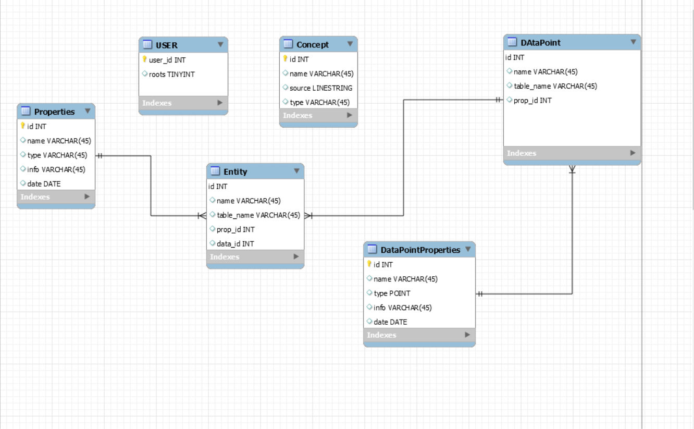

# Опис роботи СУД

## ER модель

*Числа вказують на кількісні відносини між блоками

Модель показує взаємодію користувача з данними, які пропонує наш ресурс, та взаємодію між самими даними.
Користувач має доступ до усіх типів данних, тобто до DataPoint'ів, Entity та Concept'ів. Вони ж, в свою чергу посилаються одне на одне як показано на схемі.

--------------------------------------------

## Реляційна таблиця 

